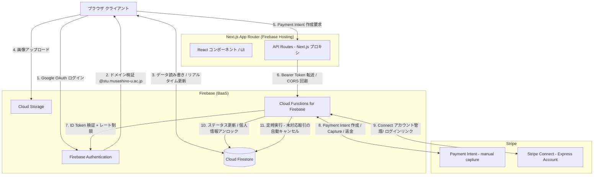
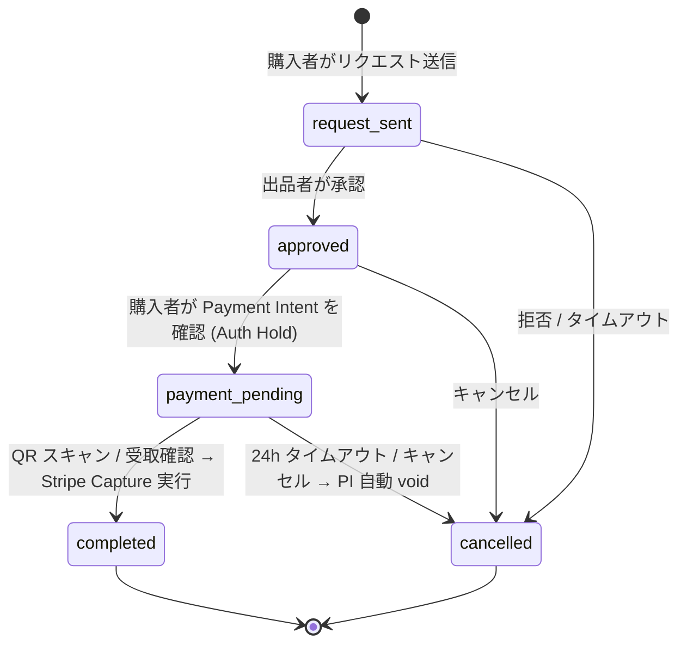

# Musalink

武蔵野大学 学生専用 教科書・物品マッチングプラットフォーム

Version: 1.0.0 | Status: Live | 本番URL: https://musa-link.web.app/

---

## プロジェクト概要

Musalink は、武蔵野大学の学生間で教科書や学修資料・生活用品などを安全かつ安価に循環させることを目的とした自主開発の C2C Web プラットフォームです。

学内ドメイン制限による完全クローズドな認証環境と、Stripe Connect を用いたエスクロー決済フローを組み合わせることで、現実的な信頼性のもとで実現しています。

本プロジェクトは学生による完全な個人開発であり、大学の公式プロジェクトではありません。

---

## システムアーキテクチャ

本アプリケーションは、Next.js (App Router) をフロントエンドとし、Firebase と Stripe を組み合わせたサーバーレスアーキテクチャで構成されています。Firebase Hosting 上に静的エクスポートされたフロントエンドを置き、Cloud Functions が Stripe とのセキュアな通信をすべて担います。



---

## 取引ステータスの状態遷移



---

## 技術的な工夫点と実装の詳細

### 1. 学内ドメイン制限による多重セキュリティ認証

`AuthContext.tsx` でのクライアントサイド検証と、Cloud Functions (`createPaymentIntent` など) でのサーバーサイド ID Token 検証の二重構造により、不正なドメインのアカウントを排除しています。

- `lib/constants.ts` で許可ドメインを `ALLOWED_DOMAINS = ["stu.musashino-u.ac.jp", "musashino-u.ac.jp"]` として一元管理
- ログイン直後に `signOut()` を即座に呼び出してセッションを破棄することで、非許可ドメインの侵入を防止
- メールアドレスのプレフィックス（`s25xxxx`）から入学年度を解析し、学年（B1〜B4）を `calculateGrade()` 関数で自動算出

```typescript
// AuthContext.tsx - クライアントサイドのドメイン検証
const isAllowed = ALLOWED_DOMAINS.some(domain => email.endsWith(domain));
if (!isAllowed) {
    await signOut(auth); // 即座にサインアウト
    toast.error("武蔵野大学のアカウントのみ利用可能です");
    return;
}
```

### 2. Stripe Connect を用いた C2C エスクロー決済フロー

エスクローを実現するために `capture_method: 'manual'` の Payment Intent を使用し、決済の承認（Auth Hold）と実際の売上確定（Capture）を分離しています。

```
[購入者が「支払う」] 
    → createPaymentIntent (Cloud Functions: onRequest)
    → Stripe: Payment Intent 作成 (capture_method: 'manual')
    → StripePaymentForm で confirmPayment() → Auth Hold (仮押さえ)
    → Firestore: status = 'payment_pending'
    
[QR スキャン / 受取確認ボタン]
    → capturePayment (Cloud Functions: onCall, idempotencyKey 付き)
    → Stripe: paymentIntents.capture()
    → Firestore: status = 'completed' + unlocked_assets 書き込み
```

Stripe Connect Express アカウントを利用し、`transfer_data.destination` と `application_fee_amount` を設定することで、プラットフォーム手数料（価格の 10%、最低 50 円）を差し引いた残額を自動的に出品者に送金しています。

### 3. QR コードを利用した対面受け渡しの安全性担保

非対面での不正な「受取完了」操作を防ぐため、取引詳細ページで `QRCodeGenerator` コンポーネントが取引 ID を埋め込んだ固有の QR コードを生成します。購入者がこの QR コードをスキャンすることが、Cloud Functions の `capturePayment` 実行の起点となります。

また、`capturePayment` は `buyer_id !== callerId` の検証を行い、購入者本人以外からの実行を拒否します。

### 4. Firestore の Public/Private データ設計とプライバシー保護

ユーザーデータを公開情報と秘匿情報に厳格に分離する Firestore コレクション設計を採用しています。

| コレクション | アクセス権限 | 保存データ |
|---|---|---|
| `users/{uid}` | 認証済みユーザー全員が読み取り可能 | ニックネーム・学部・学年・評価スコア |
| `users/{uid}/private_data/profile` | 本人のみ読み書き可能 | メールアドレス・Stripe Connect ID |

`capturePayment` 実行時に、`private_data` から学籍番号・大学メールを取得して `unlocked_assets` に書き込み、取引当事者のみが閲覧できる形で情報を開示します。これにより、決済完了前はお互いの個人情報が一切見えない設計を実現しています。

### 5. IDOR 対策とサーバーサイド主導の権限管理

`createStripeLoginLink` において、クライアントから渡されたパラメータ（Stripe アカウント ID 等）を直接使用せず、サーバーサイドで Firebase Auth の JWT を検証してユーザーを特定した後、Firestore の `private_data` から安全に ID を取得します。

```typescript
// functions/src/index.ts - IDOR 対策の実装例
const profileRef = db.collection('users').doc(userId).collection('private_data').doc('profile');
const profileSnap = await profileRef.get();
const stripeConnectId = profileSnap.data()?.stripe_connect_id; // クライアント入力は不使用
const link = await stripe.accounts.createLoginLink(stripeConnectId);
```

### 6. 入力バリデーションと冪等性の保証

Cloud Functions の全エンドポイントで、`zod` ライブラリによるスキーマ検証を実施しています。また、Payment Intent の作成・キャンセル・返金には `idempotencyKey` を設定し、ネットワーク障害時のリトライによる二重課金を防止しています。

```typescript
const idempotencyKey = `pi_create_${transactionId}`;
const paymentIntent = await stripe.paymentIntents.create(paymentIntentData, { idempotencyKey });
```

### 7. 取引の自動タイムアウトと Stripe Auth Hold のボイドキャンセル

Cloud Functions の `cancelStaleTransactions` が **60 分ごと**に定時実行され、`payment_pending` 状態のまま 24 時間放置された取引を自動的にキャンセルします。この際、Stripe の Auth Hold も `paymentIntents.cancel()` を呼び出してボイドするため、購入者のクレジットカードの与信を自動で解放します。

### 8. OpenBD API を利用した ISBN 自動入力と出品体験の最適化

`services/books.ts` において OpenBD API と連携しています。出品時に 10 桁または 13 桁の ISBN を入力するだけで、書名・著者・出版社・書影画像が自動補完されます。ハイフン有無を問わず処理し、API が `null` を返した場合も graceful にフォールバックします。

### 9. ゼロヒット需要検知によるデータ戦略

`services/analytics.ts` にて、検索結果が 0 件だった場合に `logSearchMiss(keyword, filters, userId)` として Firestore の `analytics_logs` コレクションにロギングします。ロギング処理は fire-and-forget 型の非同期処理で実装しており、このエラーがアプリ全体の動作を阻害しない設計になっています。

---

## 技術スタック

| カテゴリ | 技術 | バージョン | 選定の背景と役割 |
|:---|:---|:---|:---|
| **フロントエンド** | Next.js (App Router) | 15系 | RSC による描画効率化、ルーティング・API の統合管理 |
| | React | 19 | 最新の Server/Client Components モデルで描画最適化 |
| | TypeScript | 5系 | 型による安全性、特にFirestore ドキュメントの型定義で恩恵 |
| | Tailwind CSS | v3 | ユーティリティファーストで高速なスタイリング |
| | shadcn/ui | - | Radix UI ベースの高品質 UI コンポーネント |
| | react-qr-code | - | 取引専用 QR コードのクライアントサイド生成 |
| **バックエンド** | Firebase Authentication | - | Google OAuth + サーバーサイド JWT 検証による認証 |
| | Cloud Firestore | - | リアルタイムデータ同期、セキュリティルールで権限管理 |
| | Cloud Storage | - | 商品画像のストレージ |
| | Cloud Functions for Firebase | - | Stripe との全セキュア通信を担うサーバーレス関数 |
| | Firebase Hosting | - | 静的エクスポートされたフロントエンドのホスティング |
| **決済** | Stripe Connect (Express) | - | C2C マーケットプレイス型の売上分配と KYC |
| | Stripe Webhooks | - | 非同期の決済イベント（口座更新等）の受信 |
| **バリデーション** | Zod | - | Cloud Functions の受信データのスキーマ検証 |
| **外部 API** | OpenBD | - | ISBN から書籍情報（書名・著者・書影）の自動取得 |

---

## Firestore コレクション構造

```
users/{uid}
    ├── display_name, grade, department, trust_score, charges_enabled, ...（公開情報）
    └── private_data/profile
            └── email, stripe_connect_id, student_id, ...（秘匿情報）

items/{itemId}
    └── title, price, seller_id, category, isbn, status, ...

transactions/{txId}
    ├── buyer_id, seller_id, item_id, status, payment_intent_id, ...
    └── unlocked_assets（決済完了後のみ書き込み）
            └── student_id, university_email, unlockedAt

users/{uid}/notifications/{notifId}
    └── type, title, body, read, createdAt

analytics_logs/{logId}
    └── event, data, timestamp, userAgent

conversations/{txId}/messages/{msgId}
    └── sender_id, text, createdAt
```

---

## ディレクトリ構成

```
.
├── app/                    # Next.js App Router（ページと API Routes）
│   ├── api/                # Next.js API Routes（Cloud Functions へのプロキシ）
│   │   ├── create-payment-intent/
│   │   ├── unlock-transaction/
│   │   └── stripe-connect/
│   ├── items/              # 出品一覧・詳細・新規出品
│   ├── transactions/       # 取引一覧・詳細・新規取引
│   ├── seller/payout/      # 売上・振込申請
│   ├── admin/              # 管理画面
│   └── legal/              # 利用規約・プライバシー・特商法
├── components/
│   ├── transaction/        # TransactionDetailView, StripePaymentForm, QRCodeGenerator, RevealableContent...
│   ├── layout/             # Header, Footer, InAppBrowserGuard, Breadcrumbs
│   └── ui/                 # shadcn/ui ベースの汎用コンポーネント
├── contexts/
│   └── AuthContext.tsx     # Google Auth + ドメイン検証 + userData マージ
├── services/
│   ├── firestore.ts        # Firestore CRUD 操作
│   ├── analytics.ts        # ゼロヒット検索ログ等のイベントロギング
│   └── books.ts            # OpenBD API 連携（ISBN 検索）
├── lib/
│   ├── constants.ts        # 許可ドメイン・手数料計算・カテゴリ等の定数
│   └── firebase.ts         # Firebase 初期化
├── types/
│   └── index.ts            # User, Item, Transaction, Notification の型定義
├── functions/src/
│   ├── index.ts            # Cloud Functions 全体（決済・キャンセル・評価等）
│   └── notifications.ts    # 取引・メッセージ時のメール通知
├── firestore.rules         # Firestore セキュリティルール
└── storage.rules           # Storage セキュリティルール
```

---

## 開発者

武蔵野大学 経済学部 / 松田

---
© 2026 Musalink
