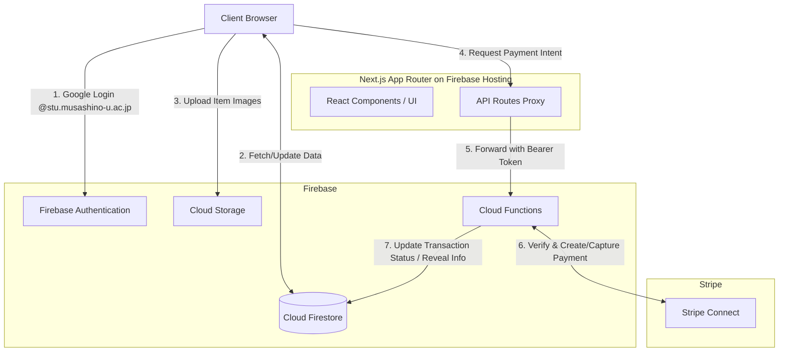

# Musalink

武蔵野大学 学生専用 教科書マッチングプラットフォーム

Version: 1.0.0 | Status: Live

## プロジェクト概要

Musalink は、武蔵野大学の学生間で教科書や学修資料を安全かつ安価に循環させることを目的とした、自主開発の Web プラットフォームです。

従来の掲示板や SNS での売買における「決済の不安」や「検索のしづらさ」といった課題を、最新の Web 技術を用いて解決することを主眼に置いています。学内ドメインによる完全クローズドな環境と、エスクロー決済を組み合わせることで、C2C 取引における信頼性を担保しています。

Note: 本プロジェクトは学生による完全な個人開発であり、大学の公式プロジェクトではありません。

---

## 本番環境

現在、以下の URL で稼働しており、実際に利用可能です。

URL: https://musa-link.web.app/

*   閲覧: ログインなしで出品一覧を閲覧可能。
*   利用: 武蔵野大学の Google アカウント (`@stu.musashino-u.ac.jp`) による OAuth ログインを経ることで、出品・購入リクエスト・チャット等の全機能が利用可能となります。

---

## 解決する課題とシステム設計のアプローチ

本アプリケーションは、単なるマッチングにとどまらず、実際の運用におけるリスクやフリクションを最小化するため、以下の具体的な技術的アプローチを実装しています。

### 1. 取引の安全性とプライバシー保護 (Revealable Content)
決済が「仮押さえ（payment_pending）」状態となり、商品の受け渡しが完了（completed）するまで、取引の当事者間でさえも個人の識別情報（学籍番号、大学メールアドレス等）を相互に秘匿する設計を導入しています。
これを実現するため、フロントエンドの `RevealableContent` コンポーネントおよび Firestore 上の `private_data` コレクションへの厳格なアクセス制御を連携させ、決済と情報開示のタイミングを完全に同期しています。

### 2. QRコードを利用した対面受け渡しの安全性担保
本サービスはキャンパス内での手渡しを前提としているため、非対面での不正な「受取完了」操作を防止する仕組みを設けています。
`QRCodeGenerator` コンポーネントを通じて取引専用の一意なQRコードをフロントエンドで生成し、買い手が売り手のスマートフォン画面をスキャンすることをトリガーに、Cloud Functions 経由で Stripe の Capture API を叩き本決済（売上確定）を実行するフローを構築しています。

### 3. OpenBD API による出品体験の最適化
教科書出品の心理的ハードルを下げるため、`services/books.ts` において OpenBD API と連携しています。
ユーザーが10桁または13桁の ISBN コードを入力するだけで、タイトル、著者、出版社、および書影画像を自動補完し、正確なデータによる出品をアシストします。

### 4. IDOR対策とバックエンド主導の権限管理 (Cloud Functions)
Stripe Connect のログインリンク発行（`createStripeLoginLink`）や取引状況のアンロック（`unlockTransaction`）処理において、クライアントからの ID 指定などのパラメータに依存する Insecure Direct Object Reference (IDOR) の脆弱性を排除しています。
すべてのセキュアな操作は、Firebase Auth が発行する JWT を元に Cloud Functions 内でユーザーを特定し、Firestore の秘匿領域（`users/{uid}/private_data`）を参照するサーバーサイド主導の権限管理で構成されています。

### 5. ゼロヒット需要検知によるデータ戦略
`services/analytics.ts` において、ユーザーが教科書を検索して1件も該当しなかった場合（ゼロヒット検索）のクエリを自動的にロギングする機構を備えています。「法学部の1年生が『民法入門』を探しているが在庫がない」といった潜在的な需要（Demand Mismatch）をプラットフォーム側が可視化し、ピンポイントで出品を促す施策へと繋げるデータ基盤を構築しています。

---

## システムアーキテクチャ

本アプリケーションは、Next.js (App Router) をフロントエンドとし、Firebase (BaaS) と Stripe (決済基盤) をバックエンドに持つサーバーレスアーキテクチャを採用しています。

---

## 技術スタックと選定理由

| カテゴリ | 採用技術 | 選定理由・役割 |
| :--- | :--- | :--- |
| **Frontend** | **Next.js (App Router)** | React Server Components による描画効率化と、ルーティング・API 構築の容易さ。 |
| | **TypeScript** | 静的型付けによるバグの早期発見、およびリファクタリングの安全性の確保。 |
| | **Tailwind CSS** | ユーティリティファーストアプローチによる迅速かつ一貫性のあるスタイリング。 |
| **Backend** | **Firebase** | 認証 (Auth)、リアルタイムデータベース (Firestore)、ファイルストレージ (Storage)、サーバーレス処理 (Functions) の統合的な提供インフラとして採用。 |
| | **Firebase Hosting** | フロントエンドのシームレスなデプロイとFirebase関連サービスとの強固な連携。 |
| **Payment** | **Stripe Connect** | プラットフォーム事業者として出品者（売り手）への売上分配を自動化・法規制対応を考慮した C2C マーケットプレイス型決済ソリューションとして導入。 |

---

## 開発者

武蔵野大学 経済学部 / 松田

---
© 2026 Musalink
