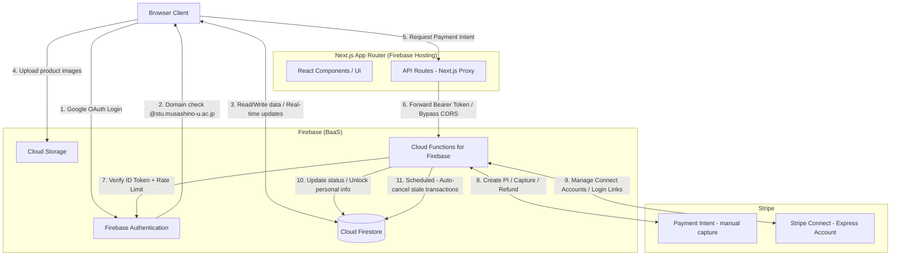
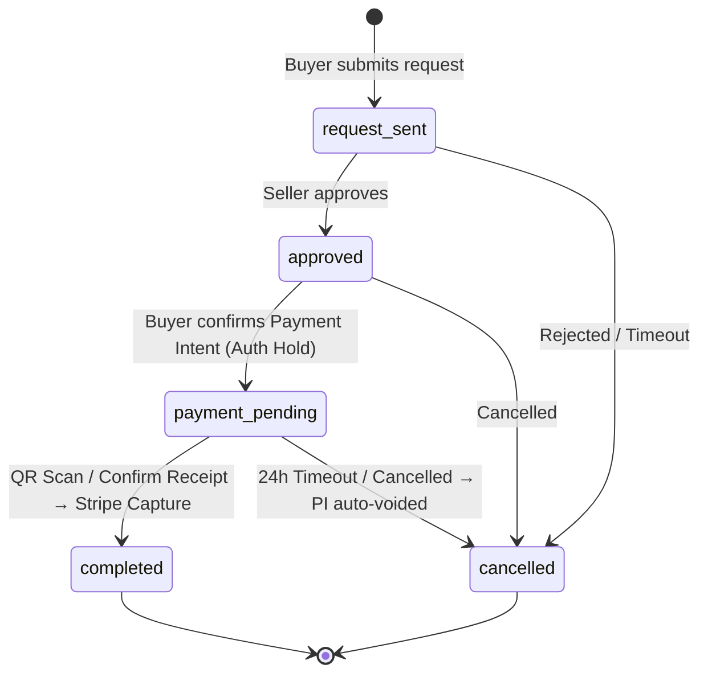

# Musalink

A C2C Textbook & Item Marketplace exclusively for Musashino University students.

Version: 1.0.0 | Status: Live | Production URL: https://musa-link.web.app/

---

## Project Overview

Musalink is a self-developed C2C web platform designed for students at Musashino University to circulate textbooks and study materials safely and affordably.

By combining a fully closed authentication environment (restricted to university domains) with an escrow payment flow using Stripe Connect, the platform enables trustworthy peer-to-peer transactions — all within a student-only community.

> Note: This is an independent student project and is not an official university service.

---

## System Architecture

The application uses a serverless architecture: a Next.js (App Router) frontend exported statically and hosted on Firebase Hosting, with Cloud Functions handling all secure communication with Stripe.



---

## Transaction State Machine



---

## Technical Highlights

### 1. Multi-Layer Authentication with Domain Enforcement

Client-side verification in `AuthContext.tsx` and server-side ID Token verification in Cloud Functions create a double-guard that rejects any account from a non-university domain.

- Allowed domains are centrally managed in `lib/constants.ts` as `ALLOWED_DOMAINS`
- On login, `signOut()` is called immediately for unauthorized domains, preventing any session establishment
- The student email prefix (`s25xxxx`) is parsed by `calculateGrade()` to automatically derive the student's academic year (B1–B4)

```typescript
// AuthContext.tsx - Client-side domain check
const isAllowed = ALLOWED_DOMAINS.some(domain => email.endsWith(domain));
if (!isAllowed) {
    await signOut(auth); // Immediate sign-out
    toast.error("Only Musashino University accounts are permitted.");
    return;
}
```

### 2. C2C Escrow Payment Flow with Stripe Connect

The platform uses `capture_method: 'manual'` Payment Intents to separate authorization (Auth Hold) from actual settlement (Capture):

```
[Buyer clicks "Pay"]
    → createPaymentIntent (Cloud Functions: onRequest)
    → Stripe: Creates PI (capture_method: 'manual')
    → StripePaymentForm calls confirmPayment() → Auth Hold placed
    → Firestore: status = 'payment_pending'

[QR Scan / Confirm Receipt]
    → capturePayment (Cloud Functions: onCall, with idempotencyKey)
    → Stripe: paymentIntents.capture()
    → Firestore: status = 'completed' + unlocked_assets written
```

Using Stripe Connect Express accounts, the platform sets `transfer_data.destination` and `application_fee_amount` to automatically deduct a platform fee (10% of price, minimum ¥50) and forward the remainder to the seller.

### 3. QR Code-Based Handover Security

To prevent fraudulent "receipt confirmation" without an actual in-person handover, a QR code embedding the transaction ID is generated client-side via the `QRCodeGenerator` component. Scanning it triggers the `capturePayment` Cloud Function, which strictly validates that the caller is the buyer (`buyer_id !== callerId` check).

### 4. Public/Private Data Split in Firestore

User data is strictly separated into public and private Firestore sub-collections:

| Collection | Read Access | Stored Data |
|---|---|---|
| `users/{uid}` | Any authenticated user | Nickname, department, grade, trust score |
| `users/{uid}/private_data/profile` | Owner only | Email, Stripe Connect ID, student ID |

Upon `capturePayment` completion, personal info (student ID, university email) is fetched from `private_data` and written to `unlocked_assets` — making it visible to the transaction parties only after payment is confirmed.

### 5. IDOR Prevention via Server-Side ID Resolution

In `createStripeLoginLink`, the function never trusts client-supplied parameters (e.g., account IDs). Instead, it verifies the Firebase Auth JWT, identifies the user, then reads the Stripe account ID from `private_data` server-side.

```typescript
// functions/src/index.ts - IDOR prevention
const profileRef = db.collection('users').doc(userId).collection('private_data').doc('profile');
const profileSnap = await profileRef.get();
const stripeConnectId = profileSnap.data()?.stripe_connect_id; // Never from client input
const link = await stripe.accounts.createLoginLink(stripeConnectId);
```

### 6. Input Validation with Zod and Idempotency Guarantees

All Cloud Functions endpoints validate incoming data using `zod` schemas. Payment Intent creation, cancellation, and refunds all use `idempotencyKey` to prevent double-charges from network retries.

```typescript
const idempotencyKey = `pi_create_${transactionId}`;
const paymentIntent = await stripe.paymentIntents.create(paymentIntentData, { idempotencyKey });
```

### 7. Scheduled Auto-Cancellation of Stale Transactions

`cancelStaleTransactions` runs every **60 minutes** via Cloud Scheduler. It finds `payment_pending` transactions untouched for 24 hours, calls `paymentIntents.cancel()` to void the Stripe Auth Hold, and sets the status to `cancelled` — automatically releasing the buyer's credit card reserve.

### 8. OpenBD API Integration for Frictionless Listing

`services/books.ts` integrates with the OpenBD API. Entering an ISBN (10 or 13 digits, with or without hyphens) auto-fills the title, author, publisher, and cover image, dramatically reducing friction for sellers listing textbooks.

### 9. Zero-Hit Search Demand Detection

`services/analytics.ts` calls `logSearchMiss(keyword, filters, userId)` whenever a search query returns no results, logging it to the `analytics_logs` Firestore collection. This is implemented as fire-and-forget to ensure analytics failures never affect the user experience.

---

## Technology Stack

| Category | Technology | Version | Role & Rationale |
|:---|:---|:---|:---|
| **Frontend** | Next.js (App Router) | v15 | RSC for server-side rendering, integrated routing and API proxy |
| | React | v19 | Latest Server/Client Components model |
| | TypeScript | v5 | Type safety, especially for Firestore document models |
| | Tailwind CSS | v3 | Utility-first rapid styling |
| | shadcn/ui | - | Accessible, high-quality components built on Radix UI |
| | react-qr-code | - | Client-side QR code generation for transaction handovers |
| **Backend** | Firebase Authentication | - | Google OAuth + server-side JWT verification |
| | Cloud Firestore | - | Real-time data sync, permission control via Security Rules |
| | Cloud Storage | - | Product image hosting |
| | Cloud Functions for Firebase | - | Serverless functions handling all Stripe communication |
| | Firebase Hosting | - | Hosts the statically exported Next.js frontend |
| **Payments** | Stripe Connect (Express) | - | C2C payout distribution and KYC verification |
| | Stripe Webhooks | - | Receiving async payment events (account updates, etc.) |
| **Validation** | Zod | - | Schema validation for all Cloud Function inputs |
| **External API** | OpenBD | - | ISBN-based book info lookup (title, author, cover image) |

---

## Firestore Collection Structure

```
users/{uid}
    ├── display_name, grade, department, trust_score, charges_enabled, ...  (public)
    └── private_data/profile
            └── email, stripe_connect_id, student_id, ...  (private, owner-only)

items/{itemId}
    └── title, price, seller_id, category, isbn, status, ...

transactions/{txId}
    ├── buyer_id, seller_id, item_id, status, payment_intent_id, ...
    └── unlocked_assets  (written only after capturePayment succeeds)
            └── student_id, university_email, unlockedAt

users/{uid}/notifications/{notifId}
    └── type, title, body, read, createdAt

analytics_logs/{logId}
    └── event, data, timestamp, userAgent

conversations/{txId}/messages/{msgId}
    └── sender_id, text, createdAt
```

---

## Directory Structure

```
.
├── app/                    # Next.js App Router (pages and API Routes)
│   ├── api/                # Next.js API Routes (proxy to Cloud Functions)
│   │   ├── create-payment-intent/
│   │   ├── unlock-transaction/
│   │   └── stripe-connect/
│   ├── items/              # Item listing, detail, and creation
│   ├── transactions/       # Transaction list, detail, and new transaction
│   ├── seller/payout/      # Earnings and payout request
│   ├── admin/              # Admin dashboard
│   └── legal/              # Terms, Privacy Policy, Specified Commercial Transactions Law
├── components/
│   ├── transaction/        # TransactionDetailView, StripePaymentForm, QRCodeGenerator, RevealableContent...
│   ├── layout/             # Header, Footer, InAppBrowserGuard, Breadcrumbs
│   └── ui/                 # shadcn/ui-based reusable components
├── contexts/
│   └── AuthContext.tsx     # Google Auth + domain validation + userData merge
├── services/
│   ├── firestore.ts        # Firestore CRUD operations
│   ├── analytics.ts        # Event logging (zero-hit search, item views)
│   └── books.ts            # OpenBD API integration (ISBN search)
├── lib/
│   ├── constants.ts        # Allowed domains, fee calculation, categories
│   └── firebase.ts         # Firebase initialization
├── types/
│   └── index.ts            # User, Item, Transaction, Notification type definitions
├── functions/src/
│   ├── index.ts            # All Cloud Functions (payments, cancellation, ratings, etc.)
│   └── notifications.ts    # Email notifications for transactions and messages
├── firestore.rules         # Firestore Security Rules
└── storage.rules           # Cloud Storage Security Rules
```

---

## Developer

Musashino University, Faculty of Economics / Matsuda

---
© 2026 Musalink
