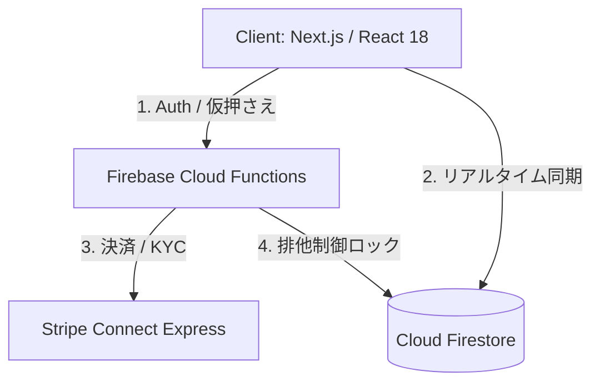

# Musalink 技術スタック＆アーキテクチャ徹底解説
**〜 GAFA面接対応の技術的深掘りから、非エンジニア向け解説・実践会話例文集まで 〜**

---

## 🚀 1. 技術スタックの全体像と選定理由（GAFA面接レベルのディープな回答）

Musalink は、単なる教科書売買アプリではなく、**「学内の信頼関係（Trust）を担保し、個人間取引（C2C）における金銭・個人情報トラブルを未然に防ぐセキュアな取引プラットフォーム」**です。このビジネス要件とユーザー体験を実現するため、以下の技術スタックを選定しています。

### 🖥️ Frontend: Next.js (App Router), TypeScript, TailwindCSS, Shadcn/ui
* **選定理由（Why Next.js & App Router?）**:
  * **パフォーマンスとUXの最適化**: キャンパス内の移動中など、モバイル回線での利用を想定。React Server Components (RSC) を活用することでクライアントへのJavaScriptバンドルサイズを最小化し、初回読み込み速度（FCP/LCP）を劇的に向上させています。
  * **型安全性と保守性（TypeScript）**: 金融取引やステータス遷移（`request_sent` ➡ `approved` ➡ `payment_pending` ➡ `completed`）を扱うため、厳格な型定義によりランタイムエラーを未然に防止しています。
  * **迅速なUI開発とデザインの一貫性**: TailwindCSS と Shadcn/ui の組み合わせにより、モダンで直感的なUIコンポーネントを高速に構築しつつ、後からの拡張やテーマ変更に耐えうる柔軟なデザインシステムを構築しています。

### ⚙️ Backend / Serverless OS: Firebase Cloud Functions (Node.js / TypeScript)
* **選定理由（Why Cloud Functions?）**:
  * **ゼロサーバー管理とオートスケール**: 学期の始まり（4月・9月）にトラフィックが急増するスパイク特性を持つため、リクエスト数に応じて自動でスケールアップ・ゼロスケールダウンするサーバーレス環境がコスト・運用面で最適です。
  * **セキュアな実行環境**: クライアントから直接操作できない決済確定（Stripe Capture）やユーザーの信頼スコア計算を Cloud Functions に隠蔽し、Firebase Authentication のトークン検証と組み合わせることで不正なAPI呼び出しを遮断しています。

### 🗄️ Database: Cloud Firestore & Firebase Security Rules
* **選定理由（Why Firestore?）**:
  * **リアルタイム同期**: 取引相手からのメッセージやステータス変更をWebsocket経由で即座にUIへ反映させるため、ポーリング不要でリアルタイムリスナーが使えるFirestoreを採用しています。
  * **トランザクションによる二重予約（ダブルブッキング）防止**: 1冊の教科書に複数の購入希望が同時に集まった際、Firestoreの ACID トランザクションを用いて排他制御を行い、在庫ロックを確実に行う仕組みを構築しています。
  * **セキュリティルール（RLS）による最小権限原則**: 学籍番号や大学メールアドレスなどの機密情報は `private_data` サブコレクションに隔離し、取引完了状態になった当事者同士にしか読み取りを許可しない厳格なセキュリティルールを敷いています。

### 💳 Payment Gateway: Stripe Connect (Express)
* **選定理由（Why Stripe Connect?）**:
  * **法規制（資金決済法）の遵守**: C2Cプラットフォームがユーザーの売上金を直接預かると「資金移動業」の免許が必要になる法的リスクがあります。Stripe Connect Expressを採用することで、資金の流れをStripe側に預け、出品者へのKYC（本人確認）や口座振込を完全に外部化・適法化しています。
  * **オーソリとキャプチャの分離（Auth & Capture）**: 購入申請時にクレジットカードの枠だけを仮押さえ（`capture_method: 'manual'`）し、キャンパスで実際に対面して商品を受け取りQRコードをスキャンした瞬間に売上を確定（Capture）させる、安全な引き渡し保証フローを実現しています。

---

## 📖 2. 非エンジニア向けの丁寧な解説＆専門用語辞書

ビジネスサイドや非エンジニアの方に向けて技術を説明する際は、**「身近な例え（アナロジー）」**を使って説明するのが最も効果的です。

| 専門用語・サービス名 | 非エンジニア向け一言解説 | 身近な例え（アナロジー） |
| :--- | :--- | :--- |
| **Next.js (ネクスト・ジェイエス)** | Web画面を爆速で表示し、動きを滑らかにする最新のWebサイト作成ツール。 | **「超優秀なキッチンとウェイター」**。注文が入る前に下ごしらえ（サーバー側処理）を済ませておくので、お客さん（ユーザー）を待たせません。 |
| **TypeScript (タイプスクリプト)** | プログラミングのミスを事前に教えてくれる「AI校正機能付きの言語」。 | **「自動スペルチェック付きの契約書」**。数字を入れるべき欄に文字を入れると、提出前に警告してくれて事故を防ぎます。 |
| **Firebase (ファイアベース)** | Googleが提供する、アプリに必要な裏側（データベース・サーバー・認証）の全部入りセット。 | **「ビル管理会社のフルパッケージ」**。警備員（認証）、倉庫（データベース）、電気工事（サーバー）をすべてお任せできます。 |
| **Cloud Functions (クラウド・ファンクションズ)** | 必要なときだけ一瞬で立ち上がり、仕事が終わると消える自動実行サーバー。 | **「日雇いのスーパー派遣社員」**。注文が殺到した時だけ1000人増員され、暇な時は0人になるので人件費（サーバー代）に無駄がありません。 |
| **Firestore (ファイアストア)** | チャットや取引の状況が、画面を更新しなくてもリアルタイムに変わるデータベース。 | **「魔法の共有ホワイトボード」**。誰かが文字を書き込むと、遠く離れた人のボードにも一瞬で同じ文字が浮かび上がります。 |
| **Stripe Connect (ストライプ・コネクト)** | メルカリやUberのような「ユーザー同士のお金のやり取り」を安全に仲介する決済システム。 | **「信頼できるネット上の銀行窓口」**。本人確認やカード情報の管理をすべて代行してくれるので、私たちはカード情報に一切触れずに済みます。 |
| **仮押さえ決済 (オーソリ＆キャプチャ)** | お金を一時的に「預かり状態」にし、商品が届いてから相手に渡す仕組み。 | **「コインロッカーの鍵」**。買う側がお金を入れて鍵をかけ（仮押さえ）、対面して品物を確認したら相手に鍵を渡す（確定）ので、持ち逃げされません。 |
| **トランザクション (排他制御)** | 複数の人が同時に同じ商品を申し込んだとき、確実の1人だけに販売する仕組み。 | **「椅子取りゲームの審判」**。同着に見えても、カメラ判定でミリ秒単位で先に触った人だけを勝者にし、二重売買を防ぎます。 |
| **Webhook (ウェブフック)** | 外部のサービス（Stripeなど）から「決済が終わったよ！」とリアルタイムに通知を受け取る仕組み。 | **「宅配ボックスの着荷通知スマホアラーム」**。荷物（データ）が届いた瞬間に教えてくれるので、何度もボックスを見に行く必要がありません。 |

---

## 💬 3. 会議や面接ですぐ使える！会話例文集（ダイアログ形式）

### 例文①：GAFA面接官に「なぜNext.jsとFirebaseを選んだのか？」を聞かれた時
**面接官**：「Musalinkの構成を見るとNext.jsとFirebaseを組み合わせていますが、AWSではなくこの構成にしたアーキテクチャ上の決定理由はなんですか？」

**あなた**：「最大の理由は**『爆発的なトラフィック・スパイクへの耐性』**と**『フロントエンド中心の高速開発（Developer Velocity）』**の両立です。大学の教科書売買という性質上、学期の最初の2週間にアクセスが集中し、それ以外の期間は落ち着くという極端な特性があります。AWSのEC2やコンテナでプロビジョニングするとアイドルコストや設計複雑性が増しますが、Firebase Cloud Functions と Next.js (Vercel) の組み合わせであれば、スパイク時に自動でスケールし、閑散期はゼロコストで運用できます。また、Firestoreのリアルタイムリスナーを活用することで、C2Cマッチングの要である対面受け渡し時のステータス同期を、ポーリングの負荷なく瞬時にクライアントへ反映できる点も大きな決め手でした。」

---

### 例文②：GAFA面接官に「決済のセキュリティと法規制への対応」を聞かれた時
**面接官**：「C2C決済では資金の持ち逃げや法規制のクリアが難しい課題ですが、どのように設計しましたか？」

**あなた**：「法的リスクとセキュリティの2つの側面から完全に切り離した設計を行いました。まず資金決済法における『資金移動業』の要件を回避するため、自社サーバーで資金を一時預かりするのではなく、**Stripe Connect Express を用いて資金移動と出品者のKYC（本人確認）を完全にStripe側へオフロード**しています。
取引の安全性については、**『Auth & Capture（オーソリとキャプチャの分離）』**パターンを採用しました。購入申請時はカードの利用枠の確保（仮押さえ）のみを行い、キャンパス内で実際に対面し、商品の状態を確認した上で相手のスマホのQRコードをスキャンした瞬間に、初めて Cloud Functions 経由で決済のキャプチャ（確定）を実行します。これにより、商品の未着トラブルや詐欺を構造的・物理的に排除しています。」

---

### 例文③：ビジネスサイド・投資家に「アプリの安全性」を説明する時
**投資家・役員**：「学生同士で教科書をやり取りする際、個人情報が漏れたり、お金だけ取られたりする危険性はないの？親御さんや大学からクレームが来ないか心配なんだけど。」

**あなた**：「ご安心ください。Musalink は**『メルカリと同じかそれ以上に安全な取引の仕組み』**を導入しています。お金のやり取りは世界最高峰のセキュリティを持つ Stripe という決済機関に任せており、運営である私たちも大学も、学生のカード情報には一切触れることができません。
また、お金を払っても商品がもらえないというトラブルを防ぐため、アプリ上で購入ボタンを押した段階では**『お金はまだ相手に渡らず、宙に浮いた預かり状態』**になっています。キャンパスで実際に会って、手渡しで教科書を受け取り、中身に問題がないことを確認してQRコードを読み取って初めて相手にお金が移ります。もし会えなかったり取引がキャンセルになれば、お金は自動的に全額戻るので、詐欺が起きようのない安心のシステムになっています。」

---

### 例文④：非エンジニアのチームメンバーに「トランザクション（二重予約防止）」を説明する時
**メンバー（営業・企画）**：「人気のある『経済学入門』の教科書に、同時に3人の学生が購入ボタンを押したらどうなるの？システムがバグって3人全員にお金が請求されたりしない？」

**あなた**：「そこはシステムが**『椅子取りゲームの超精密な審判（トランザクション処理）』**をしてくれるので大丈夫です。たとえ3人が全く同時のタイミング（0.001秒差）で購入ボタンを押したとしても、データベース（Firestore）が確実に『一番早かった1人目』だけに購入の権利を与えて商品をロックします。残りの2人には『タッチの差で売り切れました』という画面が出て、お金の仮押さえもストップするので、二重売買や余計な請求が発生することは絶対にありません。」

---

### 例文⑤：大学の先生やコンプライアンス担当者に「規約と適法性」を説明する時
**大学担当者（石原先生など）**：「学内では営利目的の物品販売や事業者の営業行為が禁止されていますが、このアプリに外部の業者が入り込んでくる心配はありませんか？」

**あなた**：「はい、その点についてもシステムおよび規約の両面で厳格にブロックしています。利用規約および特商法ページにおいて『販売を目的とする事業者（ストア等）の出店を一切禁止し、非事業者である学生個人に限る』ことを明記しています。さらに、システム登録時には大学発行のメールアドレス（`@musashino-u.ac.jp`）による認証を必須としており、外部の業者や一般人が入り込む余地をシステム的に完全に遮断しています。あくまで学生同士の助け合い（互助）をスムーズにするための非営利的なツールとして機能する設計です。」
